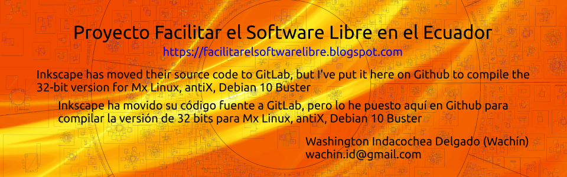

                       

Inkscape. Draw Freely.
======================

  
[https://www.inkscape.org/](https://www.inkscape.org/)

Inkscape is an open source drawing tool with capabilities similar to
Illustrator, Freehand, and CorelDRAW that uses the W3C standard scalable
vector graphics format (SVG). Some supported SVG features include
basic shapes, paths, text, markers, clones, alpha blending, transforms,
gradients, and grouping. In addition, Inkscape supports Creative Commons
meta-data, node-editing, layers, complex path operations, text-on-path,
and SVG XML editing. It also imports several formats like EPS, Postscript,
JPEG, PNG, BMP, and TIFF and exports PNG as well as multiple vector-based
formats.

Inkscape's main motivations are to provide the Open Source community
with a fully W3C compliant XML, SVG, and CSS2 drawing tool emphasizing a
lightweight core with powerful features added as extensions, and the
establishment of a friendly, open, community-oriented development
processes.

**TRADUCCIÓN**

Inkscape es una herramienta de dibujo de código abierto con capacidades similares a Illustrator, Freehand y CorelDRAW que utiliza el estándar W3C formato escalable de gráficos vectoriales (SVG). Algunas funciones SVG compatibles incluyen formas básicas, trazados, texto, marcadores, clones, mezcla alfa, transformaciones,
gradientes y agrupación. Además, Inkscape es compatible con metadatos Creative Commons, edición de nodos, capas, operaciones de ruta complejas, texto en ruta, y edición de XML SVG. También importa varios formatos como EPS, Postscript, JPEG, PNG, BMP y TIFF y exporta PNG, así como múltiples archivos basados en vectores.
formatos.

Las principales motivaciones de Inkscape son proporcionar a la comunidad de código abierto con una herramienta de dibujo XML, SVG y CSS2 totalmente compatible con W3C que enfatiza un núcleo ligero con potentes funciones añadidas como extensiones, y el establecimiento de un desarrollo amigable, abierto y orientado a la comunidad
procesos.

For installation, please see: [INSTALL.md](INSTALL.md)
